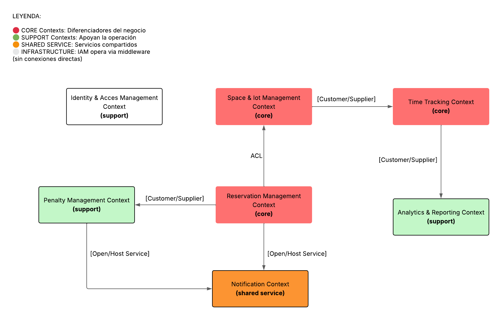
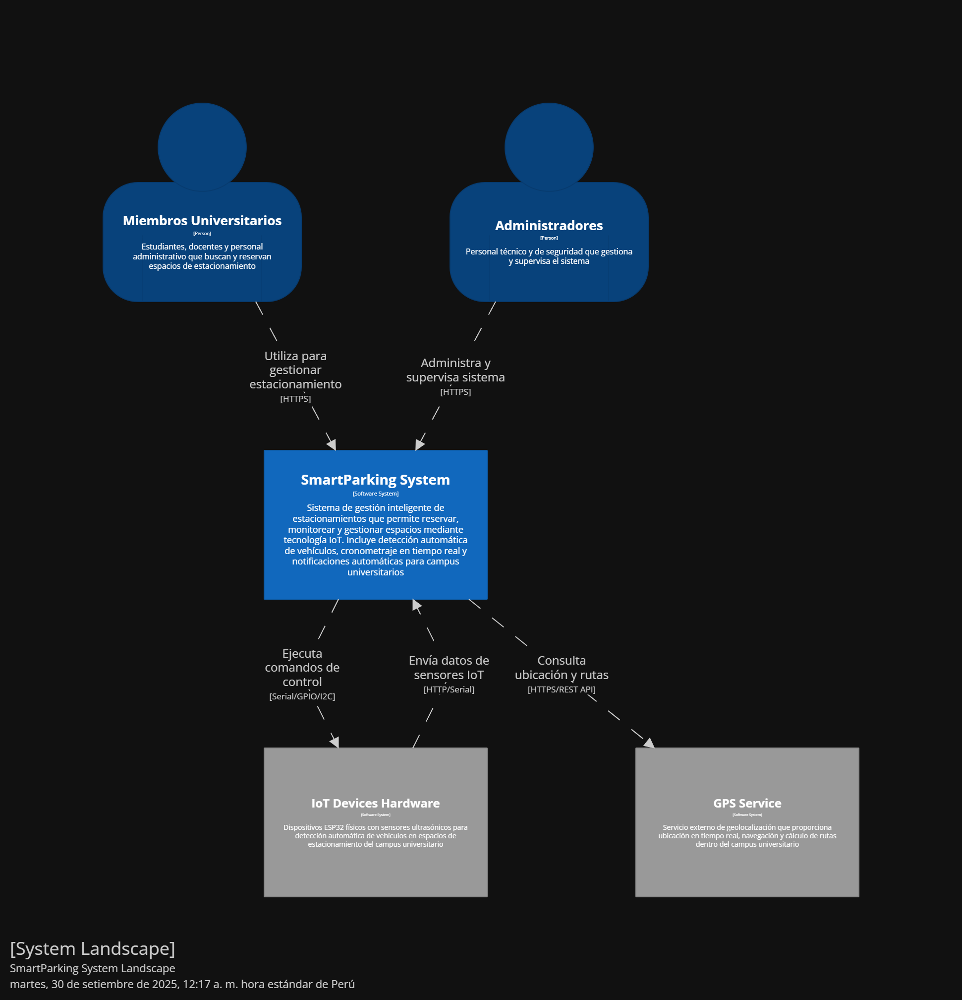
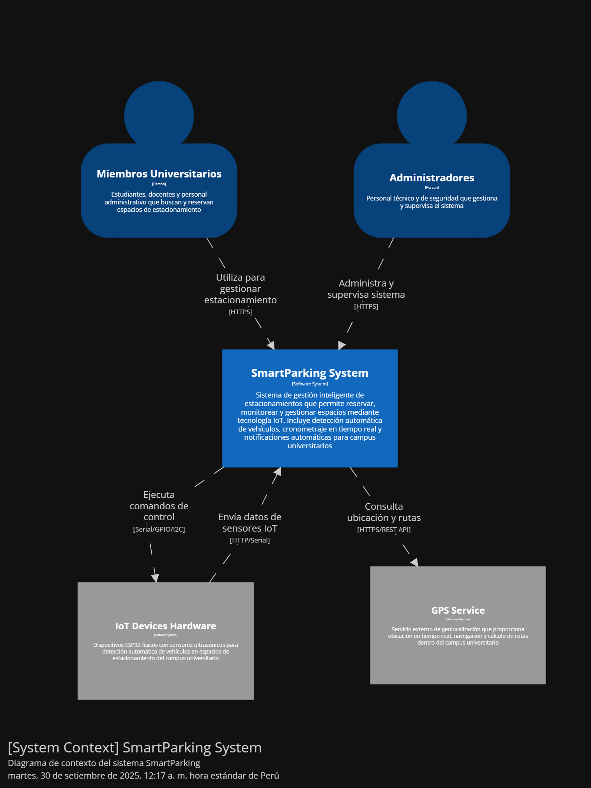
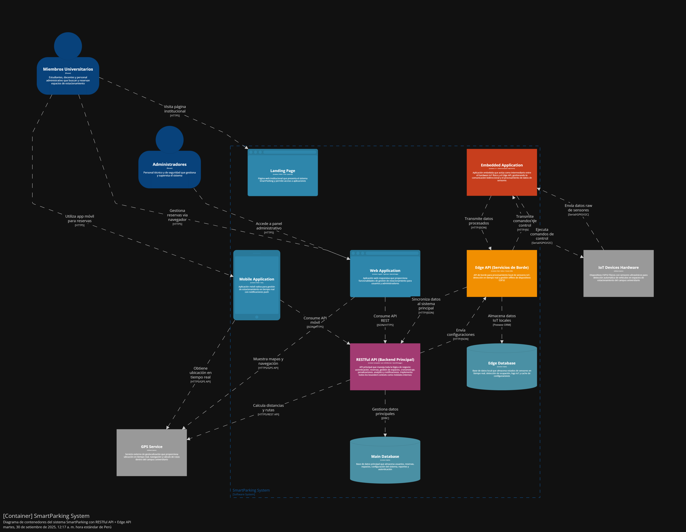

# 
Informe del Trabajo Final

    </img> 
    <strong>Universidad Peruana de Ciencias Aplicadas</strong> 
    <strong>Ingeniería de Software</strong> 
    <strong>1ASI0572 - Desarrollo de Soluciones IoT - 3475</strong> 
    <strong>Profesor: Marco Antonio Leon Baca </strong> 
     INFORME

#### Startup: **SmartPark**

#### Product: **SmartPark**

## Team  Members:

|               Member                |    Code    |
| :---------------------------------: | :--------: |
| Salgado Luna, Fernando Brian  | u202212023 |
| Ruiz Blas, Luciano Stefano  | U20211F978 |
| Linares Tejada, Leonardo Félix Jesús  | u202211168 |
| Chávez Rojas, Carlos Raúl Guillermo  | u201910317 |
| Aquije Quiroga, Luis Enrique  | u202114936 |

# Registro de Versiones del Informe

<table>
  <thead>
    <tr>
      <th>Versión</th>
      <th>Fecha</th>
      <th>Autor</th>
      <th>Descripción de modificación</th>
    </tr>
  </thead>
  <tbody>
    <tr>
      <td rowspan="6">V1</td>
      <td>08/09/2025</td>
      <td>Luciano Ruiz</td>
      <td>
        <ul>
          <li>Creación de plantilla en readme</li>
        </ul>
      </td>
    </tr>
    <tr>
      <td>18/09/2025</td>
      <td>Luciano Ruiz</td>
      <td>
        <ul>
          <li>Implementación del context mapping</li>
          <li>Implementacion student outcome</li>
          <li>Implementación de diagramas c4</li>
        </ul>
      </td>
    </tr>
    <tr>
      <td>xx</td>
      <td>xx</td>
      <td>
        <ul>
          <li>xx</li>
          <li>xx</li>
          <li>xx</li>
        </ul>
      </td>
    </tr>
    <tr>
      <td>xx</td>
      <td>xx</td>
      <td>
        <ul>
          <li>xx</li>
          <li>xx</li>
          <li>xx</li>
        </ul>
      </td>
    </tr>
    <tr>
      <td>xx</td>
      <td>xx</td>
      <td>
        <ul>
          <li>xx</li>
          <li>xx</li>
          <li>xx</li>
          <li>xx</li>
        </ul>
      </td>
    </tr>
    <tr>
      <td>xx</td>
      <td>xx</td>
      <td>
        <ul>
          <li>xx</li>
          <li>xx</li>
          <li>xx</li>
          <li>xx</li>
        </ul>
      </td>
    </tr>
  </tbody>
</table>
  </tbody>
</table>

---

# Project Report Collaboration Insights

En esta sección, regirstraremos los cambios y logros que se completaron en cada entrega del reporte.

# Contenido

- [Registro de Versiones del Informe](#registro-de-versiones-del-informe)
- [Project Report Collaboration Insights](#project-report-collaboration-insights)
- [Student Outcome](#student-outcome)
- [Capítulo I: Introducción](#capítulo-i-introducción)
   * [1.1. Startup Profile](#11-startup-profile)
      + [1.1.1. Descripción de la Startup](#111-descripción-de-la-startup)
      + [1.1.2. Perfiles de integrantes del equipo](#112-perfiles-de-integrantes-del-equipo)
   * [1.2. Solution Profile](#12-solution-profile)
      + [1.2.1. Antecedentes y problemática](#121-antecedentes-y-problemática)
      + [1.2.2. Lean UX Process](#122-lean-ux-process)
         - [1.2.2.1. Lean UX Problem Statements](#1221-lean-ux-problem-statements)
         - [1.2.2.2. Lean UX Assumptions](#1222-lean-ux-assumptions)
         - [1.2.2.3. Lean UX Hypothesis Statements](#1223-lean-ux-hypothesis-statements)
         - [1.2.2.4. Lean UX Canvas](#1224-lean-ux-canvas)
   * [1.3. Segmentos objetivo](#13-segmentos-objetivo)
- [Capítulo II: Requirements Elicitation & Analysis](#capítulo-ii-requirements-elicitation-analysis)
   * [2.1. Competidores](#21-competidores)
      + [2.1.1. Análisis competitivo](#211-análisis-competitivo)
      + [2.1.2. Estrategias y tácticas frente a competidores](#212-estrategias-y-tácticas-frente-a-competidores)
   * [2.2. Entrevistas](#22-entrevistas)
      + [2.2.1. Diseño de entrevistas](#221-diseño-de-entrevistas)
      + [2.2.2. Registro de entrevistas](#222-registro-de-entrevistas)
      + [2.2.3. Análisis de entrevistas](#223-análisis-de-entrevistas)
   * [2.3. Needfinding](#23-needfinding)
      + [2.3.1. User Personas](#231-user-personas)
      + [2.3.2. User Task Matrix](#232-user-task-matrix)
      + [2.3.3. User Journey Mapping](#233-user-journey-mapping)
      + [2.3.4. Empathy Mapping](#234-empathy-mapping)
   * [2.4. Big Picture EventStorming](#24-big-picture-eventstorming)
   * [2.5. Ubiquitous Language](#25-ubiquitous-language)
- [Capítulo III: Requirements Specification](#capítulo-iii-requirements-specification)
   * [3.1. User Stories](#31-user-stories)
   * [3.2. Impact Mapping](#32-impact-mapping)
   * [3.3. Product Backlog](#33-product-backlog)
- [Capítulo IV: Solution Software Design](#capítulo-iv-solution-software-design)
   * [4.1. Strategic-Level Domain-Driven Design](#41-strategic-level-domain-driven-design)
      + [4.1.1. Design-Level EventStorming](#411-design-level-eventstorming)
         - [4.1.1.1. Candidate Context Discovery](#4111-candidate-context-discovery)
         - [4.1.1.2. Domain Message Flows Modeling](#4112-domain-message-flows-modeling)
         - [4.1.1.3. Bounded Context Canvases](#4113-bounded-context-canvases)
      + [4.1.2. Context Mapping](#412-context-mapping)
      + [4.1.3. Software Architecture](#413-software-architecture)
         - [4.1.3.1. Software Architecture System Landscape Diagram](#4131-software-architecture-system-landscape-diagram)
         - [4.1.3.2. Software Architecture Context Level Diagrams](#4132-software-architecture-context-level-diagrams)
         - [4.1.3.3. Software Architecture Container Level Diagrams](#4133-software-architecture-container-level-diagrams)
         - [4.1.3.4. Software Architecture Deployment Diagrams](#4134-software-architecture-deployment-diagrams)
   * [4.2. Tactical-Level Domain-Driven Design](#42-tactical-level-domain-driven-design)
      + [4.2.X. Bounded Context: <Bounded Context Name>](#42x-bounded-context-bounded-context-name)
         - [4.2.X.1. Domain Layer](#42x1-domain-layer)
         - [4.2.X.2. Interface Layer](#42x2-interface-layer)
         - [4.2.X.3. Application Layer](#42x3-application-layer)
         - [4.2.X.4. Infrastructure Layer](#42x4-infrastructure-layer)
         - [4.2.X.5. Bounded Context Software Architecture Component Level Diagrams](#42x5-bounded-context-software-architecture-component-level-diagrams)
         - [4.2.X.6. Bounded Context Software Architecture Code Level Diagrams](#42x6-bounded-context-software-architecture-code-level-diagrams)
            * [4.2.X.6.1. Bounded Context Domain Layer Class Diagrams](#42x61-bounded-context-domain-layer-class-diagrams)
            * [4.2.X.6.2. Bounded Context Database Design Diagram](#42x62-bounded-context-database-design-diagram)
- [Capítulo V: Solution UI/UX Design](#capítulo-v-solution-ui/ux-design)
   * [5.1. Style Guidelines](#51-style-guidelines)
     + [5.1.1. General Style Guidelines](#511-general-style-guidelines)
     + [5.1.2. Web, Mobile and IoT Style Guidelines](#512-web-mobile-and-iot-style-guidelines)
   * [5.2. Information Architecture](#52-information-architecture)
     + [5.2.1. Organization Systems](#521-organization-systems)
     + [5.2.2. Labeling Systems](#522-labeling-systems)
     + [5.2.3. SEO Tags and Meta Tags](#523-seo-tags-and-meta-tags)
     + [5.2.4. Searching Systems](#524-searching-systems)
     + [5.2.5. Navigation Systems](#525-navigation-systems)
   * [5.3. Landing Page UI Design](#53-landing-page-ui-design)
     + [5.3.1. Landing Page Wireframe](#531-landing-page-wireframe)
     + [5.3.2. Landing Page Mock-up](#532-landing-page-mock-up)
   * [5.4. Applications UX/UI Design](#54-applications-uxui-design)
     + [5.4.1. Applications Wireframes](#541-applications-wireframes)
     + [5.4.2. Applications Wireflow Diagrams](#542-applications-wireflow-diagrams)
     + [5.4.2. Applications Mock-ups](#542-applications-mock-ups)
     + [5.4.3. Applications User Flow Diagrams](#543-applications-user-flow-diagrams)
   * [5.5. Applications Prototyping](#55-applications-prototyping)
- [Capítulo VI: Product Implementation, Validation & Deployment](#capítulo-vi-product-implementation-validation--deployment)
   * [6.1. Software Configuration Management](#61-software-configuration-management)
      + [6.1.1. Software Development Environment Configuration](#611-software-development-environment-configuration) 
      + [6.1.2. Source Code Management](#612-source-code-management)
      + [6.1.3. Source Code Style Guide & Conventions](#613-source-code-style-guide--conventions)
      + [6.1.4. Software Deployment Configuration](#614-software-deployment-configuration)
   * [6.2. Landing Page, Services & Applications Implementation](#62-landing-page-services--applications-implementation)
      + [6.2.X. Sprint n](#62x-sprint-n)
         - [6.2.X.1. Sprint Planning n](#62x1-sprint-planning-n)
         - [6.2.X.2. Aspect Leaders and Collaborators](#62x2-aspect-leaders-and-collaborators)
         - [6.2.X.3. Sprint Backlog n](#62x3-sprint-backlog-n)
         - [6.2.X.4. Development Evidence for Sprint Review](#62x4-development-evidence-for-sprint-review)
         - [6.2.X.5. Testing Suite Evidence for Sprint Review](#62x5-testing-suite-evidence-for-sprint-review)
         - [6.2.X.6. Execution Evidence for Sprint Review](#62x6-execution-evidence-for-sprint-review)
         - [6.2.X.7. Services Documentation Evidence for Sprint Review](#62x7-services-documentation-evidence-for-sprint-review)
         - [6.2.X.8. Software Deployment Evidence for Sprint Review](#62x8-software-deployment-evidence-for-sprint-review)
         - [6.2.X.9. Team Collaboration Insights during Sprint](#62x9-team-collaboration-insights-during-sprint)
   * [6.3. Validation Interviews](#63-validation-interviews)
      + [6.3.1. Diseño de Entrevistas](#631-diseño-de-entrevistas)
      + [6.3.2. Registro de Entrevistas](#632-registro-de-entrevistas)
      + [6.3.3. Evaluaciones según heurísticas](#633-evaluaciones-según-heurísticas)
   * [6.4. Video About-the-Product](#64-video-about-the-product)
- [Conclusiones](#conclusiones)
   * [Conclusiones y recomendaciones](#conclusiones-y-recomendaciones)
   * [Video About-the-Team](#video-about-the-team)
- [Bibliografía](#bibliografía)
- [Anexos](#anexos)

# Student Outcome
En Ingeniería de Software, el logro de curso contribuye a alcanzar el:

ABET – EAC - Student Outcome 5: La capacidad de funcionar efectivamente en un
equipo cuyos miembros juntos proporcionan liderazgo, crean un entorno de
colaboración e inclusivo, establecen objetivos, planifican tareas y cumplen objetivos.

<table>
  <tr>
    <th>Criterio Especifico</th>
    <th>Acciones Realizadas</th>
    <th>Conclusiones</th>
  </tr>
  <tr>
    <td>Trabaja en equipo para proporcionar liderazgo en forma conjunta</td>
    <td>
        

        TB1:
        

        Luciano Ruiz : Distribui tareas equitativas y por fortalezas de cada miembro del equipo. Además, proporcione apoyo a mis companeros de equipo en sus tareas para un mejor desenvolvimiento.
        

        Fernando: 
        

        Leonardo: 
        

        Carlos: 
        

        Luis Aquije:
    </td>
    <td>
        TB1: En esta entrega logramos trabajar en equipo, apoyándonos mutuamente y colaborando en la redacción del informe. Cada uno de los integrantes participó activamente en el desarrollo de las secciones asignadas, lo que permitió un avance significativo en el proyecto. La comunicación constante y la disposición para ayudar a los demás fueron clave para el éxito de esta entrega.

     </td>
  </tr>
  <tr>
    <td>Crea un entorno colaborativo e inclusivo, establece metas, planifica tareas y cumple objetivos.</td>
    <td>
      

        TB1:
        

        Luciano Ruiz : Estableci los sprints, participe en el capitulo IV apoyando en la planificación de nuestra solución.
        

        Fernando: 
        

        Leonardo: 
        

        Carlos: 
        

        Luis Aquije:
    <td>
    TB1: En esta entrega, logramos establecer un entorno colaborativo e inclusivo, donde cada miembro del equipo pudo expresar sus ideas y contribuir al desarrollo del proyecto. La planificación de tareas y el cumplimiento de objetivos fueron fundamentales para avanzar en la redacción del informe y en la elaboración de los diagramas y documentos requeridos. La comunicación constante y el uso del tablero Kanban facilitaron la organización y el seguimiento de las tareas asignadas.
    

  </td>
  </tr>
</table>

# Capítulo I: Introducción

## 1.1. Startup Profile

### 1.1.1. Descripción de la Startup

### 1.1.2. Perfiles de integrantes del equipo

## 1.2. Solution Profile

### 1.2.1. Antecedentes y problemática

### 1.2.2. Lean UX Process

#### 1.2.2.1. Lean UX Problem Statements

#### 1.2.2.2. Lean UX Assumptions

#### 1.2.2.3. Lean UX Hypothesis Statements.

#### 1.2.2.4. Lean UX Canvas

## 1.3. Segmentos objetivo

# Capítulo II: Requirements Elicitation & Analysis

## 2.1. Competidores

### 2.1.1. Análisis competitivo

### 2.1.2. Estrategias y tácticas frente a competidores

## 2.2. Entrevistas

### 2.2.1. Diseño de entrevistas

### 2.2.2. Registro de entrevistas

### 2.2.3. Análisis de entrevistas

## 2.3. Needfinding

### 2.3.1. User Personas

### 2.3.2. User Task Matrix

### 2.3.3. User Journey Mapping

### 2.3.4. Empathy Mapping

## 2.4. Big Picture EventStorming

## 2.5. Ubiquitous Language

# Capítulo III: Requirements Specification

## 3.1. User Stories

## 3.2. Impact Mapping

## 3.3. Product Backlog

# Capítulo IV: Solution Software Design

## 4.1. Strategic-Level Domain-Driven Design

### 4.1.1. Design-Level EventStorming

#### 4.1.1.1. Candidate Context Discovery

#### 4.1.1.2. Domain Message Flows Modeling

#### 4.1.1.3. Bounded Context Canvases

### 4.1.2. Context Mapping

#### Proceso para Crear el Context Mapping y Análisis de Alternativas

##### 1. Pasos para Crear el Context Mapping

###### 1.1. Identificación de los Bounded Contexts
- **Identity and Access Management (IAM)**
- **Reservation Management**
- **Space & IoT Management**
- **Time Tracking**
- **Penalty Management**
- **Analytics & Reporting**
- **Notification**

###### 1.2. Identificación de Relaciones entre Bounded Contexts

1. **Reservation Management** → **Space & IoT Management**: Relación de **Customer/Supplier con ACL**.
   - *Reservation Management* necesita asignar espacios físicos cuando se confirman reservas.
   - *Space & IoT Management* provee control de espacios y dispositivos IoT.
   - Anti-Corruption Layer protege la lógica de reservas de cambios en hardware.

2. **Space & IoT Management** → **Time Tracking**: Relación de **Customer/Supplier**.
   - *Space & IoT Management* inicia y detiene cronómetros basado en detección de sensores.
   - *Time Tracking* provee servicios de cronometraje para sesiones de estacionamiento.

3. **Time Tracking** → **Analytics & Reporting**: Relación de **Customer/Supplier**.
   - *Time Tracking* provee datos de duración y patrones de uso.
   - *Analytics & Reporting* consume estos datos para generar métricas y reportes.

4. **Reservation Management** → **Penalty Management**: Relación de **Customer/Supplier**.
   - *Reservation Management* reporta eventos de ausencias (no-shows).
   - *Penalty Management* provee servicios de registro y gestión de penalizaciones.

5. **Reservation Management** → **Notification**: Relación de **Open/Host Service**.
   - *Reservation Management* utiliza servicios de notificación para confirmaciones.
   - *Notification* proporciona un servicio público de mensajería.

6. **Penalty Management** → **Notification**: Relación de **Open/Host Service**.
   - *Penalty Management* utiliza servicios de notificación para alertas de ausencias.
   - *Notification* proporciona servicios centralizados de comunicación.

###### 1.3. Gestión de Identidad mediante Middleware

**Identity and Access Management (IAM)** opera como middleware de infraestructura, proporcionando autenticación transparente sin crear dependencias directas en los bounded contexts de negocio. Este patrón:

- **Separación de responsabilidades**: La autenticación es una preocupación transversal, no de dominio.
- **Middleware transparente**: Validación automática de tokens JWT antes de llegar a los bounded contexts.
- **Bounded contexts limpios**: Reciben información de usuario ya validada sin conocer detalles de autenticación.

##### 2. Análisis de Alternativas y Preguntas Clave

###### 2.1. ¿Qué pasaría si movemos este capability a otro bounded context?
- **Caso Considerado:** Mover la capacidad de gestión de cronómetros desde *Time Tracking* hacia *Space & IoT Management*.
- **Impacto:**
  - *Space & IoT Management* tendría la responsabilidad de gestionar tanto sensores como cronómetros.
  - Incrementaría el acoplamiento de *Space & IoT Management*.
- **Discusión:**
  - Es recomendable mantener la separación, ya que aunque ambos están relacionados con el uso físico del espacio, *Time Tracking* maneja lógica de negocio específica (métricas, históricos) mientras que *Space & IoT* se enfoca en hardware. Pueden interactuar mediante eventos bien definidos.

###### 2.2. ¿Qué pasaría si descomponemos este capability y movemos uno de los sub-capabilities a otro bounded context?
- **Caso Considerado:** Descomponer *Penalty Management* en sub-capabilities como *AbsenceDetection* y *SuspensionManagement* y mover *AbsenceDetection* a *Reservation Management*.
- **Impacto:**
  - Implicaría que *Reservation Management* pueda detectar ausencias directamente, liberando responsabilidades de *Penalty Management*.
  - *SuspensionManagement* seguirá gestionando el sistema de "3 strikes".
- **Discusión:**
  - Esta descomposición podría ser beneficiosa ya que las ausencias están directamente relacionadas con las reservas. Sin embargo, mantener toda la lógica de penalizaciones unificada facilita la gestión del sistema de "3 strikes" y evita dispersar reglas de negocio relacionadas.

###### 2.3. ¿Qué pasaría si partimos el bounded context en múltiples bounded contexts?
- **Caso Considerado:** Partir *Space & IoT Management* en *Physical Spaces* y *IoT Device Management*.
- **Impacto:**
  - Separar la gestión física de espacios de la gestión de dispositivos IoT.
  - Organizaría mejor las responsabilidades entre infraestructura física y tecnológica.
- **Discusión:**
  - Aunque son conceptos diferentes, están fuertemente acoplados en el dominio de SmartParking. Los sensores están físicamente asociados a espacios específicos y la lógica de detección requiere coordinar ambos aspectos. Dividirlos podría crear complejidad innecesaria en la comunicación.

###### 2.4. ¿Qué pasaría si tomamos este capability de estos 3 contexts y lo usamos para formar un nuevo context?
- **Caso Considerado:** Crear un nuevo Bounded Context llamado *Session Management* que combine capacidades de *Reservation Management*, *Time Tracking* y *Space & IoT Management* relacionadas con sesiones activas de estacionamiento.
- **Impacto:**
  - Unificaría toda la lógica de gestión de sesiones activas en un solo contexto.
  - Reduciría la comunicación entre contextos durante el flujo principal de uso.
- **Discusión:**
  - Aunque la gestión de sesiones es central al negocio, combinar estos contextos violaría el principio de separación de responsabilidades. Cada contexto actual tiene un propósito claro y bien definido. Un contexto unificado sería demasiado grande y difícil de mantener.

###### 2.5. ¿Qué pasaría si duplicamos una funcionalidad para romper la dependencia?
- **Caso Considerado:** Duplicar la funcionalidad de notificaciones en funcionalidades específicas para cada tipo, tales como *ReservationNotification*, *PenaltyNotification*, *AlertNotification*, etc.
- **Impacto:**
  - Las funcionalidades estarían mejor desacopladas, pero se repetiría mucho código.
  - Podría generar inconsistencias en el formato y entrega de notificaciones.
- **Discusión:**
  - No se recomienda, pues aumentaría la complejidad y la dificultad de mantenimiento. Es mejor utilizar el patrón Open/Host Service con un contexto de *Notification* centralizado que maneje todas las comunicaciones de manera consistente.

###### 2.6. ¿Qué pasaría si creamos un shared service para reducir la duplicación entre múltiples bounded contexts?
- **Caso Considerado:** Crear un servicio compartido de validación de reglas de negocio al que puedan acceder *Reservation Management* y *Penalty Management*.
- **Impacto:**
  - Reduciría la duplicación de validaciones comunes (ej: verificar estado del usuario).
  - Permitiría centralizar reglas transversales del sistema.
- **Discusión:**
  - Esto podría ser beneficioso para reglas muy específicas y compartidas, pero debe hacerse con cuidado para no crear un "god service". Es preferible mantener las validaciones específicas dentro de cada contexto y solo compartir utilidades muy genéricas.

###### 2.7. ¿Qué pasaría si aislamos los core capabilities y movemos los otros a un context aparte?
- **Caso Considerado:** Aislar las capacidades core de gestión de espacios en *Space & IoT Management* y mover las funcionalidades de IoT a un contexto separado llamado *Device Management*.
- **Impacto:**
  - Se reduciría la complejidad de *Space & IoT Management*.
  - Se especializarían mejor las responsabilidades.
- **Discusión:**
  - En el dominio de SmartParking, los espacios físicos y los dispositivos IoT están intrínsecamente relacionados. Separar estas capacidades requeriría mucha coordinación y comunicación entre contextos, añadiendo complejidad sin beneficios claros.

##### 3. Alternativa Recomendada de Context Mapping

1. **Mantener la estructura actual de 7 contextos** - cada uno tiene responsabilidades bien definidas.
2. **Implementar Anti-Corruption Layer (ACL)** entre *Reservation Management* y *Space & IoT Management* para proteger de cambios en el hardware.
3. **Usar Open/Host Service** para *Notification Context* - servicio público para todas las comunicaciones.
4. **Establecer Customer/Supplier** entre contextos según el flujo de control del negocio.
5. **Implementar middleware para IAM** - separación de concerns transversales de la lógica de dominio.

##### 4. Patrones de Relaciones Aplicados

- **Anti-corruption Layer (ACL)**: Para proteger *Reservation Management* de cambios en hardware IoT.
- **Open/Host Service**: *Notification* como servicio público para múltiples contextos.
- **Customer/Supplier**: Relaciones direccionales claras para flujo de datos según modelo de negocio.
- **Middleware Pattern**: IAM como concern transversal implementado en la capa de infraestructura.

##### 5. Implementación Técnica

###### 5.1. Middleware de Autenticación

El sistema implementa autenticación mediante middleware Express que:

- Intercepta todas las requests a endpoints protegidos
- Valida tokens JWT con IAM
- Inyecta información de usuario validada en el request
- Permite que bounded contexts operen con datos ya autenticados

###### 5.2. Arquitectura Monolítica Modular

Aunque implementa una arquitectura monolítica, los Bounded Contexts identificados sirven como módulos organizacionales que:

- Definen la estructura interna del código
- Establecen la división de responsabilidades del equipo  
- Determinan las interfaces entre componentes
- Facilitan la evolución futura hacia microservicios si fuera necesario

### 4.1.3. Software Architecture

URL Structurizr para apreciar mejor los diagramas C4: <a href="https://structurizr.com/share/106335">https://structurizr.com/share/106335</a>
  

#### 4.1.3.1. Software Architecture System Landscape Diagram
El System Landscape Diagram ilustra la arquitectura general del sistema SmartParking, mostrando los diferentes actores y componentes que lo componen en el contexto universitario. Este diagrama proporciona una visión general de cómo se organizan los distintos usuarios y servicios en el ecosistema del sistema, así como las relaciones entre ellos. Los miembros universitarios (estudiantes, docentes y personal administrativo) no se consideran actores internos del sistema, sino como actores externos que interactúan y se benefician del sistema de gestión inteligente de estacionamientos. En este caso, el sistema SmartParking se despliega como una solución integral que puede ser implementada en cualquier campus universitario, manteniendo la flexibilidad para futuras integraciones con sistemas institucionales como Active Directory. El diagrama incluye dos grupos principales de usuarios: Miembros Universitarios (que utilizan el sistema para encontrar y reservar espacios) y Administradores (que gestionan y supervisan el funcionamiento del sistema). La arquitectura está diseñada para ser escalable y adaptable a diferentes entornos universitarios, proporcionando un servicio gratuito de estacionamiento inteligente mediante tecnología IoT. 

  

  

#### 4.1.3.2. Software Architecture Context Level Diagrams
El diagrama de contexto del sistema ilustra la interacción entre el sistema SmartParking y los actores externos que interactúan con él. Este diagrama proporciona una visión general de cómo el sistema se integra como una solución autónoma para la gestión de estacionamientos universitarios. En este caso, el sistema SmartParking opera de manera independiente sin dependencias críticas de sistemas externos, manteniendo toda la funcionalidad core internamente. Los Miembros Universitarios interactúan con el sistema para realizar reservas de espacios de estacionamiento, consultar disponibilidad en tiempo real, recibir notificaciones automáticas de confirmación de llegada/salida y gestionar sus reservas activas. Los Administradores utilizan el sistema para configurar espacios de estacionamiento, supervisar la ocupación en tiempo real, gestionar usuarios del sistema y generar reportes operacionales. El sistema mantiene un diseño limpio sin integraciones complejas, enfocándose en proporcionar una experiencia de usuario fluida y una gestión eficiente de recursos de estacionamiento mediante tecnología IoT avanzada. 

  

  

#### 4.1.3.3. Software Architecture Container Level Diagrams
A continuación, se presenta el diagrama de contenedores del sistema SmartParking, que ilustra los diferentes componentes y su interacción dentro de la arquitectura del software. Este diagrama proporciona una visión detallada de cómo se organizan los distintos servicios y aplicaciones en el sistema, así como las relaciones entre ellos. El sistema SmartParking se basa en una arquitectura híbrida RESTful API + Edge Computing que se divide en varios contenedores especializados, cada uno con funcionalidades y responsabilidades específicas. Los usuarios podrán utilizar la Landing Page estática para conocer las características del sistema y acceder a las aplicaciones. Una vez registrados, tendrán acceso a una aplicación web (Angular) y aplicación móvil (Flutter), las cuales consumirán datos desde la RESTful API principal desarrollada en Spring Boot + Java con base de datos MySQL.
En el contexto de IoT, existen dispositivos ESP32 físicos con sensores ultrasónicos que funcionan como sistemas externos hardware. Los datos de estos dispositivos son procesados a través de una Embedded Application (C++ + ESP32 Framework) que actúa como intermediario, enviando información procesada hacia el Edge API (Flask + Python) con base de datos SQLite local para procesamiento en tiempo real con latencia mínima. El Edge API sincroniza los datos relevantes con la RESTful API principal, creando un flujo de datos eficiente: Hardware IoT → Embedded App → Edge API → RESTful API → Frontend Applications. Esta arquitectura garantiza escalabilidad distribuida, procesamiento local de sensores, y una experiencia de usuario fluida tanto para reservas como para detección automática de vehículos. 

  

  

#### 4.1.3.4. Software Architecture Deployment Diagrams

## 4.2. Tactical-Level Domain-Driven Design

### 4.2.X. Bounded Context: <Bounded Context Name>

#### 4.2.X.1. Domain Layer

#### 4.2.X.2. Interface Layer

#### 4.2.X.3. Application Layer

#### 4.2.X.4. Infrastructure Layer

#### 4.2.X.5. Bounded Context Software Architecture Component Level Diagrams

#### 4.2.X.6. Bounded Context Software Architecture Code Level Diagrams

##### 4.2.X.6.1. Bounded Context Domain Layer Class Diagrams

##### 4.2.X.6.2. Bounded Context Database Design Diagram

# Capítulo V: Solution UI/UX Design

## 5.1. Style Guidelines

### 5.1.1. General Style Guidelines

### 5.1.2. Web, Mobile and IoT Style Guidelines

## 5.2. Information Architecture

### 5.2.1. Organization Systems

### 5.2.2. Labeling Systems

### 5.2.3. SEO Tags and Meta Tags

### 5.2.4. Searching Systems

### 5.2.5. Navigation Systems

## 5.3. Landing Page UI Design

### 5.3.1. Landing Page Wireframe

### 5.3.2. Landing Page Mock-up

## 5.4. Applications UX/UI Design

### 5.4.1. Applications Wireframes

### 5.4.2. Applications Wireflow Diagrams

### 5.4.2. Applications Mock-ups

### 5.4.3. Applications User Flow Diagrams

## 5.5. Applications Prototyping

# Capítulo VI: Product Implementation, Validation & Deployment

## 6.1. Software Configuration Management

### 6.1.1. Software Development Environment Configuration

### 6.1.2. Source Code Management

### 6.1.3. Source Code Style Guide & Conventions

### 6.1.4. Software Deployment Configuration

## 6.2. Landing Page, Services & Applications Implementation

### 6.2.X. Sprint n

#### 6.2.X.1. Sprint Planning n

#### 6.2.X.2. Aspect Leaders and Collaborators

#### 6.2.X.3. Sprint Backlog n

#### 6.2.X.4. Development Evidence for Sprint Review

#### 6.2.X.5. Testing Suite Evidence for Sprint Review

#### 6.2.X.6. Execution Evidence for Sprint Review

#### 6.2.X.7. Services Documentation Evidence for Sprint Review

#### 6.2.X.8. Software Deployment Evidence for Sprint Review

#### 6.2.X.9. Team Collaboration Insights during Sprint

## 6.3. Validation Interviews

### 6.3.1. Diseño de Entrevistas

### 6.3.2. Registro de Entrevistas

### 6.3.3. Evaluaciones según heurísticas

## 6.4. Video About-the-Product

# Conclusiones

## Conclusiones y recomendaciones

## Video About-the-Team

# Bibliografía

# Anexos
