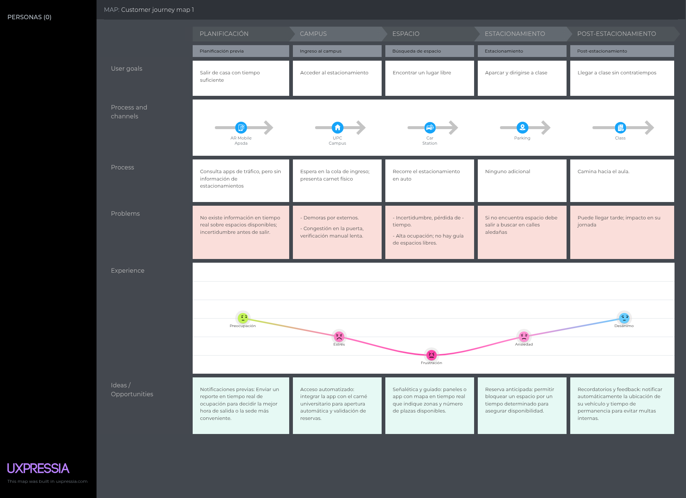
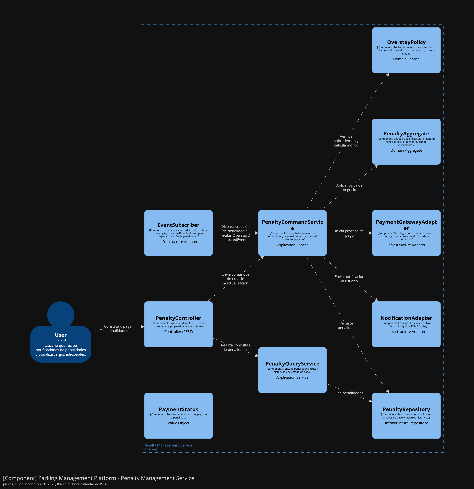

# 
Informe del Trabajo Final

    </img> 
    <strong>Universidad Peruana de Ciencias Aplicadas</strong> 
    <strong>Ingeniería de Software</strong> 
    <strong>1ASI0572 - Desarrollo de Soluciones IoT - 3475</strong> 
    <strong>Profesor: Marco Antonio Leon Baca </strong> 
     INFORME

#### Startup: **SmartPark**

#### Product: **SmartPark**

## Team  Members:

|               Member                |    Code    |
| :---------------------------------: | :--------: |
| Salgado Luna, Fernando Brian  | u202212023 |
| Ruiz Blas, Luciano Stefano  | U20211F978 |
| Linares Tejada, Leonardo Félix Jesús  | u202211168 |
| Chávez Rojas, Carlos Raúl Guillermo  | u201910317 |
| Aquije Quiroga, Luis Enrique  | u202114936 |

# Registro de Versiones del Informe

<table>
  <thead>
    <tr>
      <th>Versión</th>
      <th>Fecha</th>
      <th>Autor</th>
      <th>Descripción de modificación</th>
    </tr>
  </thead>
  <tbody>
    <tr>
      <td rowspan="6">V1</td>
      <td>xx</td>
      <td>xx</td>
      <td>
        <ul>
          <li>xx</li>
          <li>xx</li>
          <li>xx</li>
        </ul>
      </td>
    </tr>
    <tr>
      <td>xx</td>
      <td>xx</td>
      <td>
        <ul>
          <li>xx</li>
          <li>xx</li>
          <li>xx</li>
        </ul>
      </td>
    </tr>
    <tr>
      <td>xx</td>
      <td>xx</td>
      <td>
        <ul>
          <li>xx</li>
          <li>xx</li>
          <li>xx</li>
        </ul>
      </td>
    </tr>
    <tr>
      <td>xx</td>
      <td>xx</td>
      <td>
        <ul>
          <li>xx</li>
          <li>xx</li>
          <li>xx</li>
        </ul>
      </td>
    </tr>
    <tr>
      <td>xx</td>
      <td>xx</td>
      <td>
        <ul>
          <li>xx</li>
          <li>xx</li>
          <li>xx</li>
          <li>xx</li>
        </ul>
      </td>
    </tr>
    <tr>
      <td>xx</td>
      <td>xx</td>
      <td>
        <ul>
          <li>xx</li>
          <li>xx</li>
          <li>xx</li>
          <li>xx</li>
        </ul>
      </td>
    </tr>
  </tbody>
</table>
  </tbody>
</table>

---

# Project Report Collaboration Insights

En esta sección, regirstraremos los cambios y logros que se completaron en cada entrega del reporte.

# Contenido

- [Registro de Versiones del Informe](#registro-de-versiones-del-informe)
- [Project Report Collaboration Insights](#project-report-collaboration-insights)
- [Student Outcome](#student-outcome)
- [Capítulo I: Introducción](#capítulo-i-introducción)
   * [1.1. Startup Profile](#11-startup-profile)
      + [1.1.1. Descripción de la Startup](#111-descripción-de-la-startup)
      + [1.1.2. Perfiles de integrantes del equipo](#112-perfiles-de-integrantes-del-equipo)
   * [1.2. Solution Profile](#12-solution-profile)
      + [1.2.1. Antecedentes y problemática](#121-antecedentes-y-problemática)
      + [1.2.2. Lean UX Process](#122-lean-ux-process)
         - [1.2.2.1. Lean UX Problem Statements](#1221-lean-ux-problem-statements)
         - [1.2.2.2. Lean UX Assumptions](#1222-lean-ux-assumptions)
         - [1.2.2.3. Lean UX Hypothesis Statements](#1223-lean-ux-hypothesis-statements)
         - [1.2.2.4. Lean UX Canvas](#1224-lean-ux-canvas)
   * [1.3. Segmentos objetivo](#13-segmentos-objetivo)
- [Capítulo II: Requirements Elicitation & Analysis](#capítulo-ii-requirements-elicitation-analysis)
   * [2.1. Competidores](#21-competidores)
      + [2.1.1. Análisis competitivo](#211-análisis-competitivo)
      + [2.1.2. Estrategias y tácticas frente a competidores](#212-estrategias-y-tácticas-frente-a-competidores)
   * [2.2. Entrevistas](#22-entrevistas)
      + [2.2.1. Diseño de entrevistas](#221-diseño-de-entrevistas)
      + [2.2.2. Registro de entrevistas](#222-registro-de-entrevistas)
      + [2.2.3. Análisis de entrevistas](#223-análisis-de-entrevistas)
   * [2.3. Needfinding](#23-needfinding)
      + [2.3.1. User Personas](#231-user-personas)
      + [2.3.2. User Task Matrix](#232-user-task-matrix)
      + [2.3.3. User Journey Mapping](#233-user-journey-mapping)
      + [2.3.4. Empathy Mapping](#234-empathy-mapping)
   * [2.4. Big Picture EventStorming](#24-big-picture-eventstorming)
   * [2.5. Ubiquitous Language](#25-ubiquitous-language)
- [Capítulo III: Requirements Specification](#capítulo-iii-requirements-specification)
   * [3.1. User Stories](#31-user-stories)
   * [3.2. Impact Mapping](#32-impact-mapping)
   * [3.3. Product Backlog](#33-product-backlog)
- [Capítulo IV: Solution Software Design](#capítulo-iv-solution-software-design)
   * [4.1. Strategic-Level Domain-Driven Design](#41-strategic-level-domain-driven-design)
      + [4.1.1. Design-Level EventStorming](#411-design-level-eventstorming)
         - [4.1.1.1. Candidate Context Discovery](#4111-candidate-context-discovery)
         - [4.1.1.2. Domain Message Flows Modeling](#4112-domain-message-flows-modeling)
         - [4.1.1.3. Bounded Context Canvases](#4113-bounded-context-canvases)
      + [4.1.2. Context Mapping](#412-context-mapping)
      + [4.1.3. Software Architecture](#413-software-architecture)
         - [4.1.3.1. Software Architecture System Landscape Diagram](#4131-software-architecture-system-landscape-diagram)
         - [4.1.3.2. Software Architecture Context Level Diagrams](#4132-software-architecture-context-level-diagrams)
         - [4.1.3.3. Software Architecture Container Level Diagrams](#4133-software-architecture-container-level-diagrams)
         - [4.1.3.4. Software Architecture Deployment Diagrams](#4134-software-architecture-deployment-diagrams)
   * [4.2. Tactical-Level Domain-Driven Design](#42-tactical-level-domain-driven-design)
      + [4.2.X. Bounded Context: <Bounded Context Name>](#42x-bounded-context-bounded-context-name)
         - [4.2.X.1. Domain Layer](#42x1-domain-layer)
         - [4.2.X.2. Interface Layer](#42x2-interface-layer)
         - [4.2.X.3. Application Layer](#42x3-application-layer)
         - [4.2.X.4. Infrastructure Layer](#42x4-infrastructure-layer)
         - [4.2.X.5. Bounded Context Software Architecture Component Level Diagrams](#42x5-bounded-context-software-architecture-component-level-diagrams)
         - [4.2.X.6. Bounded Context Software Architecture Code Level Diagrams](#42x6-bounded-context-software-architecture-code-level-diagrams)
            * [4.2.X.6.1. Bounded Context Domain Layer Class Diagrams](#42x61-bounded-context-domain-layer-class-diagrams)
            * [4.2.X.6.2. Bounded Context Database Design Diagram](#42x62-bounded-context-database-design-diagram)
- [Capítulo V: Solution UI/UX Design](#capítulo-v-solution-ui/ux-design)
   * [5.1. Style Guidelines](#51-style-guidelines)
     + [5.1.1. General Style Guidelines](#511-general-style-guidelines)
     + [5.1.2. Web, Mobile and IoT Style Guidelines](#512-web-mobile-and-iot-style-guidelines)
   * [5.2. Information Architecture](#52-information-architecture)
     + [5.2.1. Organization Systems](#521-organization-systems)
     + [5.2.2. Labeling Systems](#522-labeling-systems)
     + [5.2.3. SEO Tags and Meta Tags](#523-seo-tags-and-meta-tags)
     + [5.2.4. Searching Systems](#524-searching-systems)
     + [5.2.5. Navigation Systems](#525-navigation-systems)
   * [5.3. Landing Page UI Design](#53-landing-page-ui-design)
     + [5.3.1. Landing Page Wireframe](#531-landing-page-wireframe)
     + [5.3.2. Landing Page Mock-up](#532-landing-page-mock-up)
   * [5.4. Applications UX/UI Design](#54-applications-uxui-design)
     + [5.4.1. Applications Wireframes](#541-applications-wireframes)
     + [5.4.2. Applications Wireflow Diagrams](#542-applications-wireflow-diagrams)
     + [5.4.2. Applications Mock-ups](#542-applications-mock-ups)
     + [5.4.3. Applications User Flow Diagrams](#543-applications-user-flow-diagrams)
   * [5.5. Applications Prototyping](#55-applications-prototyping)
- [Capítulo VI: Product Implementation, Validation & Deployment](#capítulo-vi-product-implementation-validation--deployment)
   * [6.1. Software Configuration Management](#61-software-configuration-management)
      + [6.1.1. Software Development Environment Configuration](#611-software-development-environment-configuration) 
      + [6.1.2. Source Code Management](#612-source-code-management)
      + [6.1.3. Source Code Style Guide & Conventions](#613-source-code-style-guide--conventions)
      + [6.1.4. Software Deployment Configuration](#614-software-deployment-configuration)
   * [6.2. Landing Page, Services & Applications Implementation](#62-landing-page-services--applications-implementation)
      + [6.2.X. Sprint n](#62x-sprint-n)
         - [6.2.X.1. Sprint Planning n](#62x1-sprint-planning-n)
         - [6.2.X.2. Aspect Leaders and Collaborators](#62x2-aspect-leaders-and-collaborators)
         - [6.2.X.3. Sprint Backlog n](#62x3-sprint-backlog-n)
         - [6.2.X.4. Development Evidence for Sprint Review](#62x4-development-evidence-for-sprint-review)
         - [6.2.X.5. Testing Suite Evidence for Sprint Review](#62x5-testing-suite-evidence-for-sprint-review)
         - [6.2.X.6. Execution Evidence for Sprint Review](#62x6-execution-evidence-for-sprint-review)
         - [6.2.X.7. Services Documentation Evidence for Sprint Review](#62x7-services-documentation-evidence-for-sprint-review)
         - [6.2.X.8. Software Deployment Evidence for Sprint Review](#62x8-software-deployment-evidence-for-sprint-review)
         - [6.2.X.9. Team Collaboration Insights during Sprint](#62x9-team-collaboration-insights-during-sprint)
   * [6.3. Validation Interviews](#63-validation-interviews)
      + [6.3.1. Diseño de Entrevistas](#631-diseño-de-entrevistas)
      + [6.3.2. Registro de Entrevistas](#632-registro-de-entrevistas)
      + [6.3.3. Evaluaciones según heurísticas](#633-evaluaciones-según-heurísticas)
   * [6.4. Video About-the-Product](#64-video-about-the-product)
- [Conclusiones](#conclusiones)
   * [Conclusiones y recomendaciones](#conclusiones-y-recomendaciones)
   * [Video About-the-Team](#video-about-the-team)
- [Bibliografía](#bibliografía)
- [Anexos](#anexos)

# Student Outcome
En Ingeniería de Software, el logro de curso contribuye a alcanzar el:

ABET – EAC - Student Outcome 5: La capacidad de funcionar efectivamente en un
equipo cuyos miembros juntos proporcionan liderazgo, crean un entorno de
colaboración e inclusivo, establecen objetivos, planifican tareas y cumplen objetivos.

<table>
  <tr>
    <th>Criterio Especifico</th>
    <th>Acciones Realizadas</th>
    <th>Conclusiones</th>
  </tr>
  <tr>
    <td>Trabaja en equipo para proporcionar liderazgo en forma conjunta</td>
    <td>
        

        TB1:
        

        Luciano Ruiz:
        

        Fernando: 
        

        Leonardo: 
        

        Carlos: 
        

        Luis Aquije:
    </td>
    <td>
        TB1: En esta entrega logramos trabajar en equipo, apoyándonos mutuamente y colaborando en la redacción del informe. Cada uno de los integrantes participó activamente en el desarrollo de las secciones asignadas, lo que permitió un avance significativo en el proyecto. La comunicación constante y la disposición para ayudar a los demás fueron clave para el éxito de esta entrega.

     </td>
  </tr>
  <tr>
    <td>Crea un entorno colaborativo e inclusivo, establece metas, planifica tareas y cumple objetivos.</td>
    <td>
      

        TB1:
        

        Luciano Ruiz:
        

        Fernando: 
        

        Leonardo: 
        

        Carlos: 
        

        Luis Aquije:
    <td>
    TB1: En esta entrega, logramos establecer un entorno colaborativo e inclusivo, donde cada miembro del equipo pudo expresar sus ideas y contribuir al desarrollo del proyecto. La planificación de tareas y el cumplimiento de objetivos fueron fundamentales para avanzar en la redacción del informe y en la elaboración de los diagramas y documentos requeridos. La comunicación constante y el uso del tablero Kanban facilitaron la organización y el seguimiento de las tareas asignadas.
    

  </td>
  </tr>
</table>

# Capítulo I: Introducción

## 1.1. Startup Profile

### 1.1.1. Descripción de la Startup

### 1.1.2. Perfiles de integrantes del equipo

## 1.2. Solution Profile

### 1.2.1. Antecedentes y problemática

### 1.2.2. Lean UX Process

#### 1.2.2.1. Lean UX Problem Statements

#### 1.2.2.2. Lean UX Assumptions

#### 1.2.2.3. Lean UX Hypothesis Statements.

#### 1.2.2.4. Lean UX Canvas

## 1.3. Segmentos objetivo

# Capítulo II: Requirements Elicitation & Analysis

## 2.1. Competidores

### 2.1.1. Análisis competitivo

<table border="1" style="border-collapse: collapse; width: 100%;">
    <thead>
        <tr>
            <th colspan="6" style="text-align: center;">Competitive Analysis Landscape</th>
        </tr>
        <tr>
            <td colspan="2">¿Por qué llevar a cabo este análisis?</td>
            <td colspan="4">
                Para dar a conocer a los competidores que se presentan en nuestra Startup.
            </td>
        </tr>
    </thead>
    <tbody>
        <tr style="text-align: center;">
            <td colspan="2">Empresas</td>
            <td><strong>SafePark</strong> </td>
            <td><strong>ParkSmart</strong> </td>
            <td><strong>ParkingDoor</strong> </td>
            <td><strong>Parkealo</strong> </td>
        </tr>
        <!-- Perfil -->
        <tr>
            <td rowspan="2" style="writing-mode: vertical-lr; text-align: center;">Perfil</td>
            <td>Overview</td>
            <td>Sistema IoT para reservas y gestión gratuita de estacionamientos universitarios.</td>
            <td>Solución global de smart parking con sensores, cámaras y software para ciudades.</td>
            <td>Control de accesos a estacionamientos mediante app y dispositivos IoT.</td>
            <td>Plataforma local peruana de gestión integral de estacionamientos con app móvil y reportes.</td>
        </tr>
        <tr>
            <td>¿Qué valor ofrece a los clientes?</td>
            <td>Reserva gratuita, optimización académica y sostenibilidad en campus universitarios.</td>
            <td>Amplia experiencia internacional en proyectos de smart cities.</td>
            <td>Simplicidad en accesos inteligentes y gestión de permisos.</td>
            <td>Conocimiento del contexto local y soporte en Perú.</td>
        </tr>
        <!-- Perfil de Marketing -->
        <tr>
            <td rowspan="2" style="writing-mode: vertical-lr; text-align: center;">Perfil de Marketing</td>
            <td>Mercado objetivo</td>
            <td>Universidades en Latinoamérica.</td>
            <td>Gobiernos municipales, centros comerciales, aeropuertos.</td>
            <td>Empresas, residencias y oficinas privadas.</td>
            <td>Estacionamientos privados y públicos en Perú.</td>
        </tr>
        <tr>
            <td>Estrategias de marketing</td>
            <td>Convenios con universidades y asociaciones estudiantiles (B2B2C).</td>
            <td>Alianzas con gobiernos y concesionarias.</td>
            <td>Promoción a través de inmobiliarias y comunidades.</td>
            <td>Marketing digital local y convenios con estacionamientos.</td>
        </tr>
        <!-- Perfil de Producto -->
        <tr>
            <td rowspan="3" style="writing-mode: vertical-lr; text-align: center;">Perfil de Producto</td>
            <td>Productos & Servicios</td>
            <td>Sensores IoT, reservas anticipadas, notificaciones, panel web.</td>
            <td>Sensores, cámaras, software de control de ocupación y pagos.</td>
            <td>App, controladores IoT de acceso, llaves digitales.</td>
            <td>App con mapa de estacionamientos, reservas y pagos.</td>
        </tr>
        <tr>
            <td>Precios & Costos</td>
            <td>Modelo de suscripción mensual a universidades.</td>
            <td>Costos elevados, modelo SaaS con hardware.</td>
            <td>Pago por dispositivo y suscripción mensual.</td>
            <td>Comisiones por transacción a usuarios y estacionamientos.</td>
        </tr>
        <tr>
            <td>Canales de distribución (Web o móvil)</td>
            <td>App móvil y web, alianzas con universidades.</td>
            <td>App, web, integraciones con ciudades inteligentes.</td>
            <td>App móvil, hardware instalado.</td>
            <td>Web, app móvil, soporte técnico local.</td>
        </tr>
        <!-- SWOT -->
        <tr>
            <td rowspan="4" style="writing-mode: vertical-lr; text-align: center;">Análisis SWOT</td>
            <td>Fortalezas</td>
            <td>Especialización en campus universitarios, bajo costo para usuarios.</td>
            <td>Experiencia internacional y soporte tecnológico.</td>
            <td>Seguridad y simplicidad en accesos.</td>
            <td>Conocimiento del mercado local.</td>
        </tr>
        <tr>
            <td>Debilidades</td>
            <td>Mercado inicial limitado a universidades.</td>
            <td>Costos altos, difícil de implementar en entornos pequeños.</td>
            <td>No orientado a espacios públicos.</td>
            <td>Cobertura geográfica reducida.</td>
        </tr>
        <tr>
            <td>Oportunidades</td>
            <td>Escalar a otras ciudades y campus corporativos.</td>
            <td>Creciente interés en ciudades inteligentes.</td>
            <td>Incremento de condominios y oficinas privadas.</td>
            <td>Expansión nacional.</td>
        </tr>
        <tr>
            <td>Amenazas</td>
            <td>Entrada de competidores globales al segmento educativo.</td>
            <td>Competencia de startups más ágiles.</td>
            <td>Limitada escalabilidad en espacios públicos.</td>
            <td>Competencia de soluciones globales más avanzadas.</td>
        </tr>
    </tbody>
</table>

### 2.1.2. Estrategias y tácticas frente a competidores

**A) Diferenciación de Servicios**  
SafePark se posicionará como la solución más especializada para el ámbito universitario, ofreciendo reservas gratuitas anticipadas, notificaciones inteligentes y liberación automática de espacios no utilizados. A diferencia de competidores como **ParkSmart** o **ParkingDoor**, SafePark no requiere grandes inversiones en hardware ni se limita únicamente al acceso, sino que integra la experiencia completa de gestión y uso en campus.

**B) Calidad Constante**  
La confiabilidad del sistema será un diferenciador frente a alternativas locales como **Parkealo**. SafePark implementará pilotos en universidades peruanas para validar métricas de ahorro de tiempo y mejora en la rotación de espacios. A partir de los resultados y del feedback de los usuarios, se aplicarán actualizaciones periódicas que garanticen un sistema robusto y en evolución continua.

**C) Servicio al Cliente de Calidad**  
El soporte será un punto clave frente a soluciones internacionales. SafePark ofrecerá atención personalizada en español, capacitación a administradores universitarios y un canal directo de soporte 24/7. Esto garantizará que tanto los estudiantes como los gestores del campus puedan utilizar el sistema desde el primer día sin fricciones, aumentando la satisfacción y la adopción.

**D) Alianzas Estratégicas**  
SafePark buscará convenios con universidades, asociaciones estudiantiles y entidades educativas para acelerar la implementación en campus. Asimismo, establecerá acuerdos con empresas locales de tecnología IoT para reducir costos de hardware y asegurar la escalabilidad. Estas alianzas permitirán a SafePark diferenciarse de competidores como **Parkealo**, que se enfocan en un mercado más comercial, al consolidarse como el referente en soluciones de movilidad universitaria.

## 2.2. Entrevistas

### 2.2.1. Diseño de entrevistas

En esta sección se presentarán las preguntas empleadas en las entrevistas, incluyendo tanto las de carácter general aplicables a todos los segmentos objetivo, como aquellas diseñadas específicamente para cada grupo en particular.

**Preguntas generales**

- ¿Qué dispositivo tecnológico usas con más frecuencia en tu día a día (celular, laptop, tablet)?
- ¿Qué navegador web usas con mayor frecuencia?
- ¿Cuáles son los canales de interacción que más utilizas (WhatsApp, correo, llamadas, apps móviles, etc.)?
- ¿Cómo describes tu personalidad en pocas palabras?
- ¿Presentas alguna frustración en tu trabajo/rutina universitaria relacionada con la movilidad o el tiempo?
- ¿Cómo se llama el distrito donde resides actualmente?

**Preguntas Segmento 1: Conductores universitarios**

- ¿Con qué frecuencia utilizas los estacionamientos de la universidad?
- En promedio, ¿cuánto tiempo tardas en encontrar un espacio disponible para estacionar?
- ¿Cuál es el mayor inconveniente que enfrentas al buscar estacionamiento en horas punta?
- ¿Qué tan útil te resultaría poder reservar un espacio antes de llegar al campus?
- ¿Qué opinas de que las reservas tengan un límite de 30 minutos para llegar antes de liberarse?
- ¿Aceptarías recibir notificaciones en tu celular sobre disponibilidad, vencimiento de reservas o recordatorios?
- ¿Qué características te parecen más valiosas en una aplicación de estacionamiento (ejemplo: rapidez, gratuidad, facilidad de uso, confiabilidad)?
- ¿Qué mejoras propondrías para que un sistema de estacionamiento inteligente se adapte mejor a tus necesidades?

**Preguntas Segmento 2: Administradores**

- ¿Cómo gestionas actualmente la ocupación de los estacionamientos en el campus?
- ¿Qué problemas principales enfrentas en la administración de los espacios (errores manuales, quejas, falta de control, etc.)?
- ¿Qué tan difícil es controlar la rotación de vehículos en horarios de mayor demanda?
- ¿Qué beneficios esperas de un sistema automatizado de control de estacionamientos?
- ¿Qué opinas de implementar un sistema que libere automáticamente los espacios reservados no utilizados?
- ¿Qué tan útil sería contar con un panel web que muestre en tiempo real la ocupación y genere reportes automáticos?
- ¿Qué barreras crees que podrían surgir al implementar un sistema inteligente de reservas (resistencia de usuarios, falta de infraestructura, costos)?
- ¿Qué indicadores te ayudarían a evaluar si un sistema como SafePark realmente mejora la eficiencia operativa del estacionamiento?

### 2.2.2. Registro de entrevistas

### 2.2.3. Análisis de entrevistas

## 2.3. Needfinding

### 2.3.1. User Personas

### 2.3.2. User Task Matrix

### 2.3.3. User Journey Mapping  

En esta sección se presentan los **User Journey Mapping** de los dos perfiles de usuario principales, resaltando las etapas clave de interacción con **SafePark**, los puntos de contacto, así como las emociones y experiencias que viven en cada fase. El objetivo es identificar oportunidades de mejora para optimizar su experiencia.  

__User Journey Map – Manuel Rojas – Conductor Universitario (As-Is)__  

__Inicio de la mañana:__ Manuel se alista para sus clases y piensa en el tiempo que le tomará encontrar estacionamiento en el campus. Siente **ansiedad** porque en días de alta demanda suele dar varias vueltas antes de hallar un espacio.  

__Camino a la universidad:__ Durante el trayecto revisa, sin éxito, si hay información en tiempo real sobre espacios libres. La **frustración** aumenta porque no cuenta con una app que le avise.  

__Búsqueda de estacionamiento:__ Llega al campus y recorre el estacionamiento esperando encontrar un lugar. Experimenta **estrés** y **apuro** por no llegar tarde a su primera clase.  

__Estacionamiento y asistencia a clases:__ Finalmente encuentra un espacio tras varios minutos. Se siente **aliviado**, aunque sabe que el proceso fue poco eficiente.  

__Salida del campus:__ Al retirarse, piensa en lo útil que sería una aplicación que permita **reservar** o recibir **alertas en tiempo real**. Termina el día con **expectativa** de una futura solución tecnológica.  

  

 

__User Journey Map – Maricarmen Tejada – Administradora de Estacionamiento (As-Is)__  

__Inicio de la jornada:__ Maricarmen comienza su día revisando manualmente el registro de espacios disponibles. Siente **presión** porque debe garantizar un flujo adecuado de vehículos sin errores.  

__Control de ocupación:__ Atiende llamadas y mensajes de personal de seguridad para conocer la disponibilidad en tiempo real. La falta de un panel centralizado le genera **estrés** y posibles **confusiones**.  

__Atención a incidencias:__ Se comunica con guardias y estudiantes cuando surgen reclamos o problemas de estacionamiento. Vive momentos de **tensión** por la dificultad de coordinar rápidamente.  

__Elaboración de reportes:__ Al final del turno, recopila datos en hojas de cálculo para entregar un informe de ocupación. Esta tarea es **tediosa** y consume demasiado tiempo.  

__Cierre del día:__ Revisa que todo quede en orden para el siguiente turno, pero se siente **agotada** y con la expectativa de contar con una herramienta que permita automatizar reservas, alertas y reportes.  

  

  

### 2.3.4. Empathy Mapping

## 2.4. Big Picture EventStorming

## 2.5. Ubiquitous Language

# Capítulo III: Requirements Specification

## 3.1. User Stories

## 3.2. Impact Mapping  

En el desarrollo de nuestro proyecto, aplicamos la metodología **Impact Mapping** como herramienta estratégica para asegurar que cada funcionalidad de **SafePark** se alinee con los objetivos de negocio y con las verdaderas necesidades de nuestros usuarios. Esta técnica permitió identificar con claridad qué queremos lograr, quiénes son los actores clave, cómo pueden influir en el resultado y qué acciones priorizar, evitando invertir recursos en características que no aporten valor directo.  

__Business goal:__  
Reducir en 30% el tiempo de búsqueda de estacionamiento en 3 meses

  

  

__Business goal:__  
Incrementar en 25% la rotación de espacios en 6 meses mediante liberación automática de reservas no utilizadas.

  

  

## 3.3. Product Backlog

# Capítulo IV: Solution Software Design

## 4.1. Strategic-Level Domain-Driven Design

### 4.1.1. Design-Level EventStorming

#### 4.1.1.1. Candidate Context Discovery

#### 4.1.1.2. Domain Message Flows Modeling

#### 4.1.1.3. Bounded Context Canvases

### 4.1.2. Context Mapping

### 4.1.3. Software Architecture

#### 4.1.3.1. Software Architecture System Landscape Diagram

#### 4.1.3.2. Software Architecture Context Level Diagrams

#### 4.1.3.3. Software Architecture Container Level Diagrams

#### 4.1.3.4. Software Architecture Deployment Diagrams

## 4.2. Tactical-Level Domain-Driven Design

### 4.2.1. Bounded Context: Identity and Access Management (IAM)
#### 4.2.1.1. Domain Layer
#### 4.2.1.2. Interface Layer
#### 4.2.1.3. Application Layer
#### 4.2.1.4. Infrastructure Layer
#### 4.2.1.5. Bounded Context Software Architecture Component Level Diagrams
#### 4.2.1.6. Bounded Context Software Architecture Code Level Diagrams
##### 4.2.1.6.1. Bounded Context Domain Layer Class Diagrams
##### 4.2.1.6.2. Bounded Context Database Design Diagram

### 4.2.2. Bounded Context: Reservation Management
#### 4.2.2.1. Domain Layer
#### 4.2.2.2. Interface Layer
#### 4.2.2.3. Application Layer
#### 4.2.2.4. Infrastructure Layer
#### 4.2.2.5. Bounded Context Software Architecture Component Level Diagrams
#### 4.2.2.6. Bounded Context Software Architecture Code Level Diagrams
##### 4.2.2.6.1. Bounded Context Domain Layer Class Diagrams
##### 4.2.2.6.2. Bounded Context Database Design Diagram

### 4.2.3. Bounded Context: Space & IoT Management
#### 4.2.3.1. Domain Layer
#### 4.2.3.2. Interface Layer
#### 4.2.3.3. Application Layer
#### 4.2.3.4. Infrastructure Layer
#### 4.2.3.5. Bounded Context Software Architecture Component Level Diagrams
#### 4.2.3.6. Bounded Context Software Architecture Code Level Diagrams
##### 4.2.3.6.1. Bounded Context Domain Layer Class Diagrams
##### 4.2.3.6.2. Bounded Context Database Design Diagram

### 4.2.4. Bounded Context: Time Tracking

El **Bounded Context Time Tracking** registra y gestiona el tiempo de uso de los espacios de estacionamiento sin límites temporales.  
Su objetivo es iniciar, detener y calcular la duración de cada sesión de estacionamiento a partir de los eventos de llegada y salida enviados por el **Space & IoT Management**.  
Los datos generados se utilizan para métricas, reportes y, eventualmente, procesos de facturación o penalización.

#### 4.2.4.1. Domain Layer.

Agregados y Entidades del Dominio **Time Tracking** en nuestra Web/Mobile Application.

En la carpeta `domain` dentro de este Bounded Context se definen las entidades, agregados y servicios de dominio que encapsulan la lógica de negocio principal.

##### TimeSession
Representa una sesión de tiempo de uso de un espacio de estacionamiento.

| Atributo | Tipo | Descripción |
|----------|------|------------|
| Id | int | Identificador único de la sesión |
| UserId | int | ID del usuario que ocupa el espacio |
| ParkingSpaceId | int | ID del espacio de estacionamiento utilizado |
| StartTime | DateTime | Fecha y hora de inicio |
| EndTime | DateTime? | Fecha y hora de finalización (puede ser nulo mientras la sesión está activa) |
| Duration | TimeSpan? | Duración total calculada cuando la sesión termina |
| Status | string | Estado de la sesión (ACTIVE, COMPLETED, CANCELLED) |

**Constructores**  
- Por parámetros individuales  
- A partir de `StartTimerCommand` y `StopTimerCommand`

##### Timer
Entidad que representa el cronómetro interno de la sesión.

| Atributo | Tipo | Descripción |
|----------|------|------------|
| Id | int | Identificador único del cronómetro |
| TimeSessionId | int | Relación con la sesión de tiempo |
| StartTick | DateTime | Momento exacto en que se inició |
| StopTick | DateTime? | Momento exacto en que se detuvo |
| Elapsed | TimeSpan? | Tiempo transcurrido |

**Constructores**  
- Por parámetros individuales  
- Desde evento `TimerStartedEvent` y `TimerStoppedEvent`

##### TimeRecord
Registro histórico de uso de un espacio, derivado de una sesión completada.

| Atributo | Tipo | Descripción |
|----------|------|------------|
| Id | int | Identificador único |
| UserId | int | ID del usuario |
| ParkingSpaceId | int | ID del espacio |
| Duration | TimeSpan | Duración final |
| DateRecorded | DateTime | Fecha de registro del historial |

##### DurationCalculator (Domain Service)
Servicio de dominio que encapsula la lógica para calcular la duración de una sesión.

**Métodos**  
- `Calculate(TimeSession session): TimeSpan`

**Comandos**

| Comando | Descripción |
|---------|------------|
| StartTimerCommand.cs | Inicia una nueva sesión de tiempo al recibir evento de llegada |
| StopTimerCommand.cs | Detiene la sesión al recibir evento de salida |
| CalculateDurationCommand.cs | Calcula la duración total de la sesión y actualiza el registro |

**Queries**

| Archivo | Descripción |
|---------|------------|
| GetActiveSessionByUserQuery.cs | Obtiene la sesión activa de un usuario |
| GetTimeHistoryByUserQuery.cs | Lista histórico de tiempos de un usuario |
| GetSpaceUsageQuery.cs | Devuelve uso de tiempo por espacio |

**Repositories (Interfaces)**

| Archivo | Descripción |
|---------|------------|
| ITimeSessionRepository.cs | Operaciones CRUD y búsqueda por usuario o espacio |
| ITimeRecordRepository.cs | Persistencia de registros históricos |
| ITimerRepository.cs | Persistencia de cronómetros activos |

**Domain Services**

| Archivo | Descripción |
|---------|------------|
| ITimeTrackingCommandService.cs | Comandos: iniciar, detener, calcular duración |
| ITimeTrackingQueryService.cs | Consultas: historial, sesiones activas |

#### 4.2.4.2. Interface Layer.

Interface Layer – Presentación de la Aplicación.

Esta capa expone los endpoints REST y transforma las solicitudes HTTP en comandos/queries para la capa de aplicación.

**Resources**

| Archivo | Función |
|---------|--------|
| StartTimerResource.cs | Recibe datos para iniciar cronómetro (UserId, ParkingSpaceId) |
| StopTimerResource.cs | Recibe datos para detener cronómetro |
| TimeSessionResource.cs | Devuelve información de una sesión (inicio, fin, duración) |
| TimeRecordResource.cs | Devuelve información histórica de uso |

**Transform/Assemblers**

| Archivo | Función |
|---------|--------|
| StartTimerCommandFromResourceAssembler.cs | Convierte StartTimerResource en StartTimerCommand |
| StopTimerCommandFromResourceAssembler.cs | Convierte StopTimerResource en StopTimerCommand |
| TimeSessionResourceFromEntityAssembler.cs | Convierte entidad TimeSession en TimeSessionResource |
| TimeRecordResourceFromEntityAssembler.cs | Convierte entidad TimeRecord en TimeRecordResource |

**Controllers**

| Controlador | Ruta base típica | Responsabilidad principal |
|-------------|------------------|--------------------------|
| TimeTrackingController.cs | /api/timetracking | Gestiona el inicio/detención de cronómetros y consulta de sesiones activas |
| TimeHistoryController.cs | /api/timetracking/history | Expone el historial de uso de tiempo por usuario o espacio |

#### 4.2.4.3. Application Layer.

Servicios de Aplicación – Gestión de Flujos de Negocio.

**Command Services**

| Clase | Descripción |
|-------|------------|
| TimeTrackingCommandService.cs | Maneja inicio, detención y cálculo de duración de una sesión; utiliza `TimeSession` y `Timer`. |

**Query Services**

| Clase | Descripción |
|-------|------------|
| TimeTrackingQueryService.cs | Devuelve información de sesiones activas, histórico de tiempo por usuario o por espacio. |

**Eventos clave**

- ✅ **Timer Started Event**: Se dispara cuando el Space & IoT Management detecta llegada.  
- ✅ **Timer Stopped Event**: Se dispara cuando se detecta salida.  
- ✅ **Duration Calculated Event**: Calcula y persiste la duración final en `TimeRecord`.  
- ✅ **Session Expired Event** (opcional): Maneja sesiones que no fueron cerradas correctamente.

#### 4.2.4.4. Infrastructure Layer.

Implementación de Repositories y adaptadores externos.

| Clase | Interfaz Implementada | Función Principal |
|-------|----------------------|------------------|
| TimeSessionRepository.cs | ITimeSessionRepository | Persiste y consulta sesiones de tiempo en la base de datos relacional (PostgreSQL/MySQL). |
| TimeRecordRepository.cs | ITimeRecordRepository | Persiste registros históricos para análisis posteriores. |
| TimerRepository.cs | ITimerRepository | Gestiona datos de cronómetros en curso. |
| TimeTrackingEventPublisher.cs | — | Publica eventos de inicio/detención a otros contextos (por ejemplo, Analytics & Reporting). |
| RealTimeDisplayAdapter.cs | — | Actualiza pantallas o notificaciones en vivo para el usuario. |

#### 4.2.4.5. Bounded Context Software Architecture Component Level Diagrams  

En el diagrama de componentes del contexto **Time Tracking** se observa la interacción del usuario con el servicio para iniciar y finalizar sesiones de tiempo, además de las dependencias entre controladores, servicios de aplicación, agregados de dominio y repositorios.  

  

 

URL Structurizr: https://structurizr.com/share/102034

#### 4.2.4.6. Bounded Context Software Architecture Code Level Diagrams  
##### 4.2.4.6.1. Bounded Context Domain Layer Class Diagrams  

El siguiente diagrama de clases muestra las entidades, servicios de dominio, interfaces de repositorio y sus relaciones que conforman el **bounded context Time Tracking**. Incluye las clases **TimeSession**, **Timer**, **TimeRecord**, el servicio de dominio **DurationCalculator** y las interfaces de repositorios que garantizan la persistencia.  

  

 

Link: https://lucid.app/lucidchart/12a7e0a9-9b1c-48d8-a6dd-ab1b1fdc7d9c/edit?viewport_loc=-456%2C-116%2C2232%2C1049%2CHWEp-vi-RSFO&invitationId=inv_c243830e-22c1-42ae-a345-cae63204a020

##### 4.2.4.6.2. Bounded Context Database Design Diagram  

El diagrama entidad-relación (ERD) de la base de datos para **Time Tracking** presenta las tablas **TimeSessions**, **Timers** y **TimeRecords**, junto con sus llaves primarias, foráneas y restricciones, reflejando la persistencia de sesiones, cronómetros y registros históricos.  

  

 

### 4.2.5. Bounded Context: Penalty Management

El **Bounded Context Penalty Management** administra el sistema de penalizaciones “3 Strikes” configurable basado en **ausencias automáticas**, sin intervención manual.  
Su objetivo es detectar usuarios que no se presenten en el estacionamiento dentro de la ventana configurada, acumular “strikes” y aplicar suspensiones temporales, enviando advertencias y reactivaciones según las reglas de negocio.

#### 4.2.5.1. Domain Layer.

Agregados y Entidades del Dominio **Penalty Management** en nuestra Web/Mobile Application.

En la carpeta `domain` de este Bounded Context se encuentran las clases principales que encapsulan la lógica de negocio para la detección de ausencias, emisión de advertencias y suspensión de usuarios.

##### Absence
Representa una ausencia registrada cuando un usuario no llega en el tiempo establecido.

| Atributo | Tipo | Descripción |
|----------|------|------------|
| Id | int | Identificador único de la ausencia |
| UserId | int | ID del usuario ausente |
| ReservationId | int | ID de la reserva no utilizada |
| DetectedAt | DateTime | Fecha y hora en que se detectó la ausencia |

**Constructores**  
- Por parámetros individuales  
- Desde `RegisterAbsenceCommand`

##### AbsenceCounter
Contador de ausencias acumuladas por usuario.

| Atributo | Tipo | Descripción |
|----------|------|------------|
| Id | int | Identificador del contador |
| UserId | int | ID del usuario |
| StrikeCount | int | Número de ausencias registradas |
| MaxStrikes | int | Límite de strikes configurable (2–5) |
| LastUpdated | DateTime | Última fecha de actualización |

**Métodos de dominio**  
- `IncrementStrike()` – Incrementa el número de ausencias.  
- `ResetCounter()` – Reinicia el contador tras suspensión.

##### Suspension
Entidad que representa la suspensión de un usuario por alcanzar el máximo de strikes.

| Atributo | Tipo | Descripción |
|----------|------|------------|
| Id | int | Identificador único |
| UserId | int | ID del usuario suspendido |
| StartDate | DateTime | Fecha de inicio de la suspensión |
| EndDate | DateTime | Fecha de reactivación automática |
| Status | string | Estado (ACTIVE, COMPLETED) |

**Métodos de dominio**  
- `Activate()` – Activa suspensión.  
- `Complete()` – Marca la suspensión como finalizada.

##### Warning
Advertencia emitida antes de la suspensión.

| Atributo | Tipo | Descripción |
|----------|------|------------|
| Id | int | Identificador único |
| UserId | int | ID del usuario |
| Message | string | Mensaje de advertencia |
| CreatedAt | DateTime | Fecha de emisión |

##### PenaltyRules (Value Object)
Objeto de valor que define las reglas de penalización configurables.

| Atributo | Tipo | Descripción |
|----------|------|------------|
| MaxStrikes | int | Límite de ausencias antes de suspensión |
| SuspensionDays | int | Días de suspensión automática |
| WindowMinutes | int | Minutos de ventana de llegada antes de marcar ausencia |

**Comandos**

| Comando | Descripción |
|---------|------------|
| RegisterAbsenceCommand.cs | Registra una nueva ausencia al no detectar llegada |
| IssueWarningCommand.cs | Emite una advertencia por ausencia |
| SuspendUserCommand.cs | Suspende usuario tras alcanzar máximo de strikes |
| ReactivateUserCommand.cs | Reactiva usuario al finalizar período de suspensión |
| ResetAbsenceCounterCommand.cs | Reinicia el contador de ausencias |
| ConfigurePenaltyRulesCommand.cs | Actualiza las reglas de penalización |

**Queries**

| Archivo | Descripción |
|---------|------------|
| GetAbsenceHistoryByUserQuery.cs | Lista las ausencias de un usuario |
| GetCurrentSuspensionQuery.cs | Obtiene información de la suspensión actual |
| GetPenaltyRulesQuery.cs | Consulta las reglas de penalización vigentes |
| GetAbsenceCounterQuery.cs | Devuelve el contador de ausencias actual de un usuario |

**Repositories (Interfaces)**

| Archivo | Descripción |
|---------|------------|
| IAbsenceRepository.cs | CRUD de ausencias |
| IAbsenceCounterRepository.cs | Maneja contador de ausencias por usuario |
| ISuspensionRepository.cs | Persiste y consulta suspensiones activas o completadas |
| IWarningRepository.cs | Registra advertencias enviadas |
| IPenaltyRulesRepository.cs | Gestiona las reglas de penalización configurables |

**Domain Services**

| Archivo | Descripción |
|---------|------------|
| IPenaltyCommandService.cs | Orquesta la lógica para registrar ausencias, emitir advertencias y suspender usuarios |
| IPenaltyQueryService.cs | Consulta histórico de ausencias, suspensiones y reglas |

#### 4.2.5.2. Interface Layer.

Interface Layer – Presentación de la Aplicación.

La carpeta `interfaces/REST` expone endpoints que permiten al sistema y a los administradores consultar o actualizar las penalizaciones y reglas.

**Resources**

| Archivo | Función |
|---------|--------|
| RegisterAbsenceResource.cs | Datos para registrar una ausencia automática |
| WarningResource.cs | Devuelve datos de advertencias emitidas |
| SuspensionResource.cs | Devuelve información de suspensiones activas |
| PenaltyRulesResource.cs | Muestra las reglas actuales de penalización |
| UpdatePenaltyRulesResource.cs | Permite a un administrador actualizar las reglas (strikes, días de suspensión, ventana de llegada) |

**Transform/Assemblers**

| Archivo | Función |
|---------|--------|
| RegisterAbsenceCommandFromResourceAssembler.cs | Convierte RegisterAbsenceResource en RegisterAbsenceCommand |
| UpdatePenaltyRulesCommandFromResourceAssembler.cs | Convierte UpdatePenaltyRulesResource en ConfigurePenaltyRulesCommand |
| SuspensionResourceFromEntityAssembler.cs | Convierte entidad Suspension en SuspensionResource |
| WarningResourceFromEntityAssembler.cs | Convierte entidad Warning en WarningResource |

**Controllers**

| Controlador | Ruta base típica | Responsabilidad principal |
|-------------|------------------|--------------------------|
| PenaltyController.cs | /api/penalty | Expone endpoints para registro de ausencias y emisión de advertencias |
| SuspensionController.cs | /api/penalty/suspension | Consulta y gestión de suspensiones de usuarios |
| PenaltyRulesController.cs | /api/penalty/rules | Consulta y actualización de reglas de penalización |

#### 4.2.5.3. Application Layer.

Servicios de Aplicación – Gestión de Flujos de Negocio.

**Command Services**

| Clase | Descripción |
|-------|------------|
| PenaltyCommandService.cs | Orquesta la lógica para registrar ausencias, emitir advertencias, suspender usuarios y reactivar automáticamente. |

**Query Services**

| Clase | Descripción |
|-------|------------|
| PenaltyQueryService.cs | Permite consultas de ausencias, suspensiones y reglas de penalización. |

**Eventos clave**

- ✅ **Absence Detected Event**: Disparado por Reservation Management cuando no hay llegada dentro de la ventana configurada.  
- ✅ **Warning Issued Event**: Notifica al Notification Context sobre la advertencia al usuario.  
- ✅ **User Suspended Event**: Marca y comunica la suspensión.  
- ✅ **User Reactivated Event**: Reactiva el acceso del usuario tras el período configurado.  

#### 4.2.5.4. Infrastructure Layer.

Implementación de Repositories y adaptadores externos.

| Clase | Interfaz Implementada | Función Principal |
|-------|----------------------|------------------|
| AbsenceRepository.cs | IAbsenceRepository | Persiste ausencias registradas y permite filtrado por usuario o fecha |
| AbsenceCounterRepository.cs | IAbsenceCounterRepository | Gestiona el conteo de ausencias de cada usuario |
| SuspensionRepository.cs | ISuspensionRepository | Persiste suspensiones activas, fechas y reactivaciones automáticas |
| WarningRepository.cs | IWarningRepository | Almacena advertencias emitidas |
| PenaltyRulesRepository.cs | IPenaltyRulesRepository | Mantiene la configuración de reglas de penalización |
| PenaltyEventPublisher.cs | — | Publica eventos hacia Notification Context para envío de alertas |
| SchedulerAdapter.cs | — | Programa tareas automáticas para reactivación de usuarios después del período de suspensión |

#### 4.2.5.5. Bounded Context Software Architecture Component Level Diagrams  

En el diagrama de componentes del contexto **Penalty Management** se evidencia la orquestación de ausencias, advertencias y suspensiones. Se detallan los controladores REST, servicios de aplicación, agregados de dominio y repositorios encargados de administrar reglas de penalización, contadores de ausencias y suspensiones.  

  

 

URL Structurizr: https://structurizr.com/share/84646

#### 4.2.5.6. Bounded Context Software Architecture Code Level Diagrams  
##### 4.2.5.6.1. Bounded Context Domain Layer Class Diagrams  

En este diagrama se aprecian las entidades **Absence**, **AbsenceCounter**, **Suspension**, **Warning** y el value object **PenaltyRules**, además de las interfaces de repositorio y servicios de dominio que encapsulan la lógica de negocio del **bounded context Penalty Management**.  

  

 

Link: https://lucid.app/lucidchart/4d516fa9-fed5-4131-8a22-16207e3b05a0/edit?viewport_loc=-3820%2C-575%2C6132%2C2883%2CHWEp-vi-RSFO&invitationId=inv_709a7505-bf02-440a-87b9-406019cc1dca

##### 4.2.5.6.2. Bounded Context Database Design Diagram  

El diagrama entidad-relación (ERD) de **Penalty Management** representa las tablas **Absences**, **AbsenceCounters**, **Suspensions** y **Warnings**, incluyendo sus claves primarias, relaciones de usuario y constraints necesarias para gestionar las penalizaciones.  

  

 

### 4.2.6. Bounded Context: Analytics & Reporting
#### 4.2.6.1. Domain Layer
#### 4.2.6.2. Interface Layer
#### 4.2.6.3. Application Layer
#### 4.2.6.4. Infrastructure Layer
#### 4.2.6.5. Bounded Context Software Architecture Component Level Diagrams
#### 4.2.6.6. Bounded Context Software Architecture Code Level Diagrams
##### 4.2.6.6.1. Bounded Context Domain Layer Class Diagrams
##### 4.2.6.6.2. Bounded Context Database Design Diagram

### 4.2.7. Bounded Context: Notification
#### 4.2.7.1. Domain Layer
#### 4.2.7.2. Interface Layer
#### 4.2.7.3. Application Layer
#### 4.2.7.4. Infrastructure Layer
#### 4.2.7.5. Bounded Context Software Architecture Component Level Diagrams
#### 4.2.7.6. Bounded Context Software Architecture Code Level Diagrams
##### 4.2.7.6.1. Bounded Context Domain Layer Class Diagrams
##### 4.2.7.6.2. Bounded Context Database Design Diagram

# Capítulo V: Solution UI/UX Design

## 5.1. Style Guidelines

### 5.1.1. General Style Guidelines

### 5.1.2. Web, Mobile and IoT Style Guidelines

## 5.2. Information Architecture

### 5.2.1. Organization Systems

### 5.2.2. Labeling Systems

### 5.2.3. SEO Tags and Meta Tags

### 5.2.4. Searching Systems

### 5.2.5. Navigation Systems

## 5.3. Landing Page UI Design

### 5.3.1. Landing Page Wireframe

### 5.3.2. Landing Page Mock-up

## 5.4. Applications UX/UI Design

### 5.4.1. Applications Wireframes

### 5.4.2. Applications Wireflow Diagrams

### 5.4.2. Applications Mock-ups

### 5.4.3. Applications User Flow Diagrams

## 5.5. Applications Prototyping

# Capítulo VI: Product Implementation, Validation & Deployment

## 6.1. Software Configuration Management

### 6.1.1. Software Development Environment Configuration

### 6.1.2. Source Code Management

### 6.1.3. Source Code Style Guide & Conventions

### 6.1.4. Software Deployment Configuration

## 6.2. Landing Page, Services & Applications Implementation

### 6.2.X. Sprint n

#### 6.2.X.1. Sprint Planning n

#### 6.2.X.2. Aspect Leaders and Collaborators

#### 6.2.X.3. Sprint Backlog n

#### 6.2.X.4. Development Evidence for Sprint Review

#### 6.2.X.5. Testing Suite Evidence for Sprint Review

#### 6.2.X.6. Execution Evidence for Sprint Review

#### 6.2.X.7. Services Documentation Evidence for Sprint Review

#### 6.2.X.8. Software Deployment Evidence for Sprint Review

#### 6.2.X.9. Team Collaboration Insights during Sprint

## 6.3. Validation Interviews

### 6.3.1. Diseño de Entrevistas

### 6.3.2. Registro de Entrevistas

### 6.3.3. Evaluaciones según heurísticas

## 6.4. Video About-the-Product

# Conclusiones

## Conclusiones y recomendaciones

## Video About-the-Team

# Bibliografía

# Anexos
